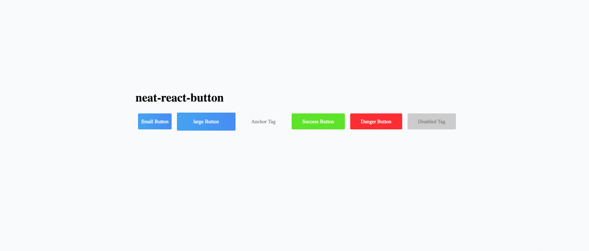

# neat-react-button

neat-react-button is a button component that makes button creation a breeze




## Installation
``yarn add neat-react-button``
or
``npm install neat-react-button``

## Work in Progress 
Implemented as a handy tool and any pull requests welcomed!

## Usage

Import `neat-react-button` in your React component:

```javascript static
import Button from 'neat-react-button'
``` 

## Color Props
there are currenctly four colors optional, primary(blue) the default one, success(green), info(white whith black font), and danger(red)

## Size Props
There are currently three sizes optional, sm, md(default) and lg. 

## Element
The button becomes anchor if there is a link existing. Otherwise a button.


### Supported props
|Prop         |Type         |Default                   |Description                           |
|-------------|-------------|--------------------------|--------------------------------------|
|size         |string       |md                        |Button size                           |
|color        |string       |primary                   |colors described by keywords          |
|Element      |string       |button                    |Type of element                       |
|disabled     |bool         |false                     |to disable button                     | 
|onClick      |function     |()=>{}                    |fired after click                     |
|text         |string       |default text              |The buttons's text                    |
|debounce     |number       |0ms                       |Interrupts button click in ms         |
|btntype      |string array |button                    |button, submit, reset                 |


You can find example of usage in the demo directory, which you can run in a local development server using npm start or yarn run start
